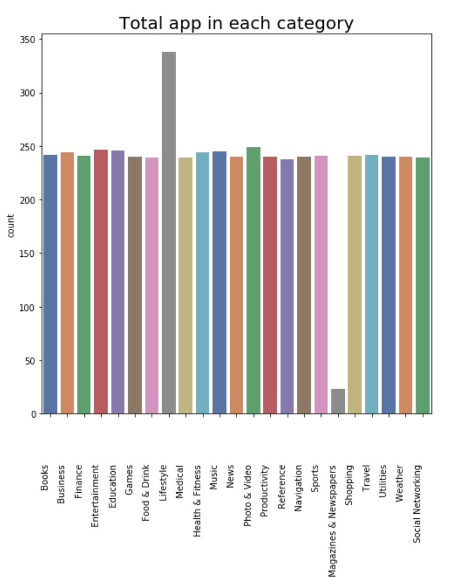
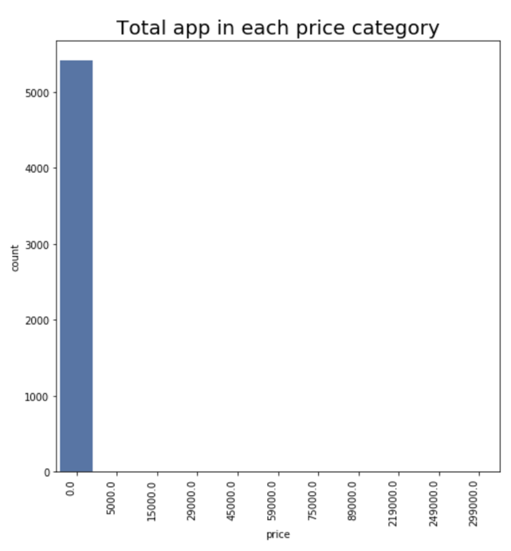
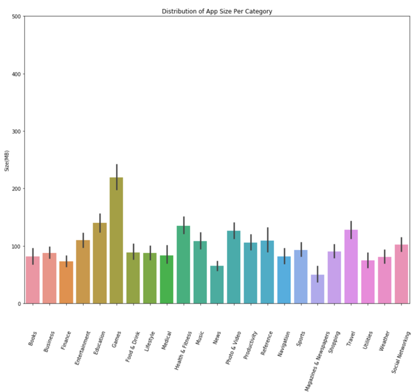
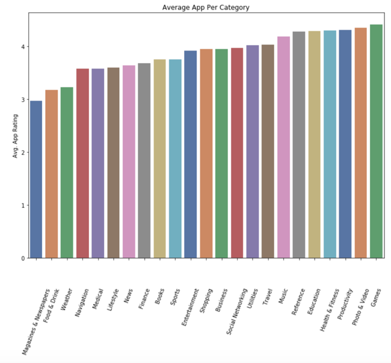

# Apple-App-Store-Indonesia
Apple App Store Indonesia is a project where I analyze and visualize data taken from the Indonesian Apple App Store. In the analysis, a lot of exciting data is obtained based on group and category.

Distribution of applications per category Apple App Store Indonesia From the results of data retrieval from the Apple App Store Indonesia, the Python programming language interprets the collected data. It shows the population of 5438 application data taken. The distribution of applications listed on the Apple App Store Indonesia is separated using the category. It shows that the category with the most counted total number of applications is the Lifestyle category application with a total of more than 300

This graph represents the distribution of each application's price in the population of Apple App Store Indonesia in IDR. It shows that the majority of applications in the Indonesian Apple App Store are free. This is an early indication that the majority of applications available in Indonesia have a free price.

This graph represents the distribution of the size of the application in each application in the population of Apple App Store Indonesia. It shows that most of the applications with the largest size in the Apple App Store Indonesia are in the Games category.

Depicted in the graph above is the distribution of the average app ratings of each application in the population of Apple App Store Indonesia. It shows that the majority of applications with several app ratings on the Apple App Store Indonesia are in the Games category with an average score above four, followed by Photos & Videos (Photos & Videos).

#These are a small part of the analysis, and you can look further if you open a notebook in this repository.
